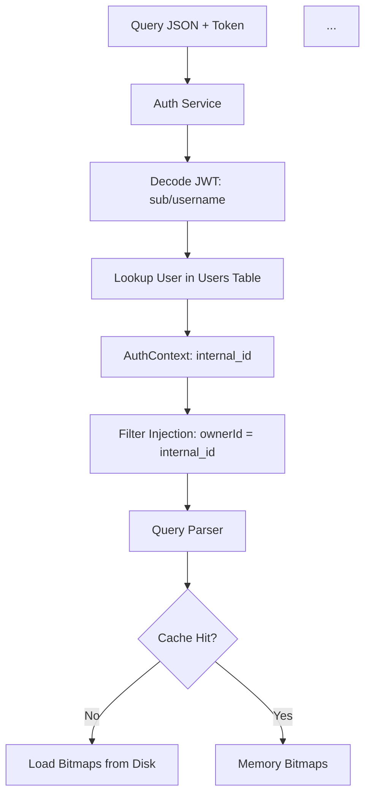

# Bittice: Flujo de Ejecución de Consultas

Este documento describe cómo funciona internamente el motor de consultas de **Bittice**. A diferencia de una base de datos tradicional que escanea filas (Row-Oriented), Bittice utiliza un enfoque **Columnar** basado en **Índices Invertidos (Roaring Bitmaps)** y archivos mapeados en memoria (`mmap`).

---

## 🏗️ Arquitectura de Archivos

Para entender la consulta, primero debemos entender qué hay en el disco para una tabla (ej. `users`):

1.  **Índices (`data/users/main/index/`)**:
    *   `bitmaps_{columna}.dat`: Diccionario serializado que mapea `Valor -> RoaringBitmap`.
    *   *Ejemplo (`bitmaps_age.dat`):*
        *   `"25"` -> `[1, 10, 55]` (IDs de filas que tienen 25 años)
        *   `"30"` -> `[2, 3]`

2.  **Datos (`data/users/main/stores/`)**:
    *   `{columna}.dat`: Archivo binario con todos los valores de la columna concatenados.
    *   `{columna}.offsets`: Archivo de posiciones (punteros) para saber dónde empieza y termina cada valor en el archivo `.dat`.

---

## 🚀 Paso a Paso: El Ciclo de Vida de una Query

Supongamos la siguiente consulta (Query Guardada):
```json
{
  "name": "get-vehicles-user",
  "entity": "goparking",
  "table": "Vehicles",
  "auth_config": {
    "enabled": true,
    "table": "Users",
    "token_col": "identifier",
    "id_col": "id",
    "filter_col": "ownerId"
  },
  "filters": [{ "field": "deletedAt", "op": "Eq", "value": "" }],
  "selected_fields": ["*"]
}
```

### 0. Resolución de Identidad (Auth Phase)
Antes de ejecutar la consulta sobre la tabla de negocio (`Vehicles`), Bittice resuelve quién es el usuario:

1.  **JWT Decoding:** Si el token recibido tiene formato JWT, Bittice decodifica el payload (Base64URL) y extrae el campo `sub` o `username`. 
    *   *Ejemplo:* Token JWT -> `sub: "b4a894c8-..."`.
2.  **User Lookup:** Busca ese identificador en la tabla de autenticación configurada (`Users`) usando la columna `token_col` (`identifier`).
3.  **Identity Mapping:** Obtiene el `id_col` (`id`) interno del usuario. 
    *   *Resultado:* `AuthContext { user_id: "123", filter_col: "ownerId" }`.
4.  **Inyección de Filtro (RLS):** Bittice inyecta automáticamente un filtro de seguridad en la consulta original:
    *   `filters += { field: "ownerId", op: "Eq", value: "123" }`
    *   `op = "And"` (para asegurar que el usuario no pueda saltarse esta restricción).

### 1. Parsing y Caché
El motor recibe la consulta ya "aumentada" con el filtro de seguridad...
*   Si los bitmaps de `age` o `active` ya están en memoria, los usa.
*   Si no, lee `bitmaps_age.dat` y `bitmaps_active.dat` y los deserializa en un `HashMap<String, RoaringBitmap>`.

### 2. Filtrado (The "Scatter" Phase)
Aquí ocurre la magia de la velocidad. **No se escanean filas**. Se opera sobre conjuntos de IDs.

*   **Optimización de Rangos (Segment Pruning - Nivel Producción):**
    *   Antes de abrir cualquier índice, el motor consulta los metadatos del segmento (`Min/Max`).
    *   Si buscas `age > 20` y el segmento tiene `max_age: 18`, **se descarta el segmento entero** instantáneamente.
    *   Si el rango es válido, entonces sí se busca en el índice invertido o se usan estructuras de árbol B+ para rangos densos, evitando iterar millones de claves individuales en campos de alta cardinalidad.

*   **Filtro de Igualdad (`active = "true"`):**
    *   Busca directamente la clave `"true"` en el índice hash de `active`.
    *   *Resultado:* `Bitmap_Active_True` = `{1, 5, 9, ...}`

### 3. Álgebra de Conjuntos (Logical Ops)
Se combinan los resultados de los filtros usando operaciones bit a bit ultra rápidas.

*   **Operación (`AND`):**
    *   `Final_Bitmap` = `Bitmap_Range_Result` **AND** `Bitmap_Active_True`
    *   Internamente: `Intersection({1, 2, 5, ...}, {1, 5, 9, ...})` -> `{1, 5, ...}`
    
*Resultado:* Ahora tenemos una lista exacta de **Internal IDs** que cumplen *todas* las condiciones.

### 4. Paginación y Ordenamiento
Hasta este punto, **no hemos leído ni un solo dato real** (nombres, direcciones, etc.), solo hemos manipulado IDs (enteros).

*   **Sorting (ORDER BY):** 
    *   *Nota de Rendimiento:* Ordenar por una columna arbitraria puede ser costoso (`O(N log N)`).
    *   Para máxima eficiencia, se recomienda usar **Top-K Selection** (min-heap) cuando hay `LIMIT`, o asegurar que la columna tenga un índice ordenado (B-Tree/Skiplist) para evitar cargar todos los valores en memoria.
    
*   **Limit/Offset:**
    *   Aplicamos el `SKIP` (Offset) y `TAKE` (Limit) sobre la lista de IDs resultante *después* del ordenamiento (o durante, si usamos Top-K).

### 5. Materialización (The "Gather" Phase)
Solo ahora vamos al disco a buscar los datos reales para esos 10 IDs finales.

Para cada columna solicitada (`name`, `age`):
1.  **Mmap:** Se mapean en memoria los archivos `.offsets` y `.dat` de la columna.
2.  **Lookup Directo:**
    *   Para el ID `5`:
        *   Leer `offsets[5]` -> Posición `1024`.
        *   Leer `offsets[6]` -> Posición `1040`.
        *   Leer `dat[1024..1040]` -> Valor `"Julian"`.
3.  **Construcción:** Se ensambla el objeto JSON final.

---

## ⚡ Por qué es rápido (y Escalable)

1.  **Zero Scan:** Nunca "busca" linealmente en los datos. Si buscas `id=5000`, salta directo a la posición exacta.
2.  **Segment Pruning:** Gracias a los metadatos `Min/Max`, puede ignorar millones de filas sin leer ni un byte del disco.
3.  **Bitwise Ops:** Las operaciones AND/OR/NOT sobre Roaring Bitmaps son extremadamente eficientes (instrucciones SIMD en CPU modernas).
4.  **Immutable Segments Cache:** Al ser los segmentos inmutables, la caché del SO y del motor **nunca necesita invalidarse** parcialmente. Si un segmento cambia, es porque se fusionó (Merge) y se creó uno nuevo, invalidando la entrada completa de forma limpia.

---
## 📊 Diagrama Visual



    
    M --> F1[Filter 1 Bitmap]
    M --> F2[Filter 2 Bitmap]
    
    F1 --> OP((AND / OR))
    F2 --> OP
    
    OP --> RES[Result Bitmap (List of IDs)]
    RES --> PAG[Apply Limit/Offset]
    
    PAG --> MAT[Materializer]
    
    MAT --> D1[(name.dat)]
    MAT --> D2[(age.dat)]
    
    D1 --> JSON[Final Result]
    D2 --> JSON
```
